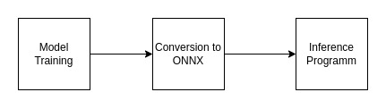
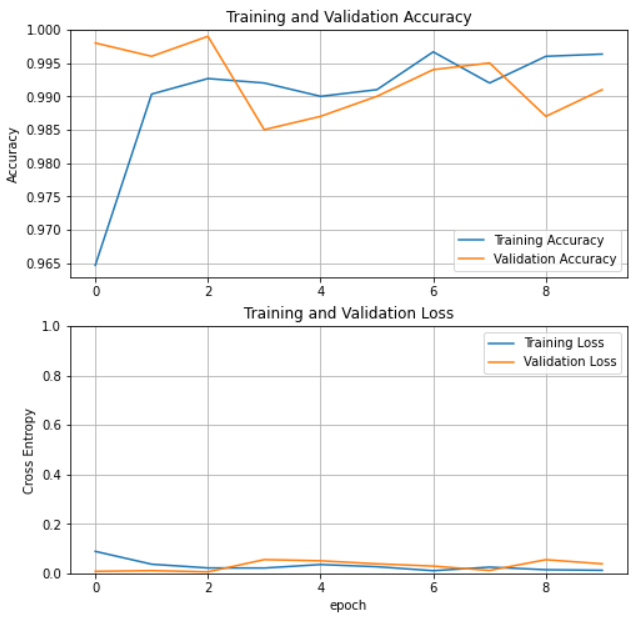

# Car Classifier in C++

This repository contains a simple car classifier in C++. In this README file the flow of the project is described. The following image summarizes the steps of the project:



## Contents
+ [Model Training](#model-training)
+ [Conversion to ONNX](#conversion-to-onnx)
+ [Inference](#inference)


## Model Training
The model is trained using the TensorFlow framework. Model base is the `MobileNetV2` model and a one layer of dense layer is added to top of the model. The base of the model is freezed and parameters are not updated during training. `MobileNetV2` outputs a `5x5x1280` tensor before dense layers. By using a global average pooling layer, these features are reduced to a `1280` length vector. This features are fed to the dense layer which outputs a single value. The positive value indicates the image is a car and the negative value indicates the image is not a car. 

The training and validation datasets are a combination of `COCO` and cars dataset from [Stanford](http://ai.stanford.edu/~jkrause/cars/car_dataset.html). I used a subset of these datasets and created a training dataset of size 3000 and validation dataset of size 1000. The classes are divided in half in both datasets.

The following figure shows the training and validation loss and accuracy curves:



To find more information about the model training, please refer to the [notebook](train/VehicleClassifier.ipynb).

## Conversion to ONNX
To run inference in C++, I used the ONNX format. ONNX stands for Open Neural Network Exchange and it is an open format to represent deep learning models. ONNX models are widely supported in various frameworks and devices. To find out more about this standard, refer to [ONNX](https://onnx.ai/) webpage. The model is converted to ONNX using the `tf2onnx` package. The following code snippet shows how to convert the model to ONNX:

```bash
$ python -m tf2onnx.convert --saved-model . --output vehicle_detector_model.onnx
```

## Inference
